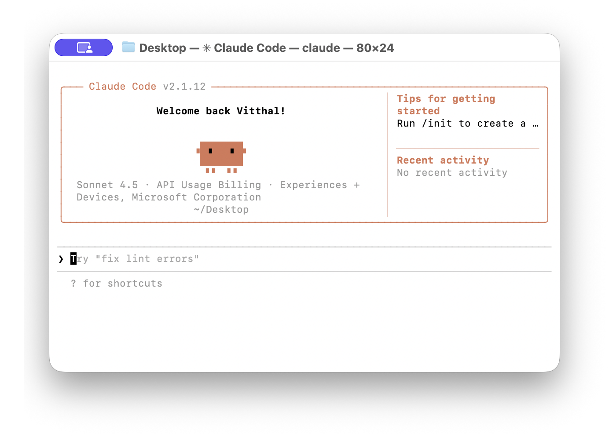

#  How to Get Started with Claude

Let's set up Claude on your computer! Just follow these easy steps.

---

### Step 1: Install Claude

Open your **Terminal** app and copy and paste the following command:

```bash
curl -fsSL https://claude.ai/install.sh | bash
```

Wait until it finishes installing.

---

### Step 2: Start Claude

In the same Terminal, type:

```bash
claude
```

You'll see some options. Pick **option 2 - Anthropic Console**.

A browser window will pop up. Continue in that browser tab.

---

### Step 3: Enter Your Email

Look at your browser. Type your Microsoft email ID when it asks you.

---

### Step 4: Go Back to Terminal

Now go back to your Terminal window.

Press `Ctrl + C` two times to close the Claude session.

---

### Step 5: Start Claude Again

In your Terminal, type one more time:

```bash
claude
```

A new tab in browser will open. Click the **Authorize** button.

Go back to your Terminal — you should see something like this:



If your screen looks like this, you're all set.

---

## 🎉 Congratulations!

You did it! Claude is now set up and ready to help you code.

---

## What's Next?

### Step 6: Create a Project Folder

Create a new folder on your Desktop. Give it any name you like (e.g., `my-project`).

---

### Step 7: Open Your Folder in Terminal

If Claude is still running in that Terminal, press `Ctrl + C` twice to exit (or open a new Terminal tab/window).

1) In Terminal, type `cd ` (note the space after `cd`):

```bash
cd 
```

2) Drag your project folder from Desktop into the Terminal window. The full path will appear.

3) Press **Enter** to jump into that folder.

4) Run `pwd` to check your current directory:

```bash
pwd
```

It should show the path to your project folder (e.g., `/Users/yourname/Desktop/my-project`).

> ⚠️ **Warning:** Avoid running Claude in your home folder (`~`) or root (`/`). This would give Claude access to your entire system. Always use a dedicated project folder.

---

### Step 8: Start Coding with Claude

If the path looks correct (e.g., `/Users/yourname/Desktop/my-project`), run Claude:

```bash
claude
```

Now start prompting to create your new app! Here are some ideas to try:

- `Make a fun tic-tac-toe game`
- `Create a simple landing page with a hero section and contact form`
- `Build a portfolio website with a gallery grid`
- `Design a beautiful pricing table with 3 tiers`
- `Create an animated navigation menu`

---

## 🎉 Congratulations!

You're all set! Have fun building amazing things with Claude.
